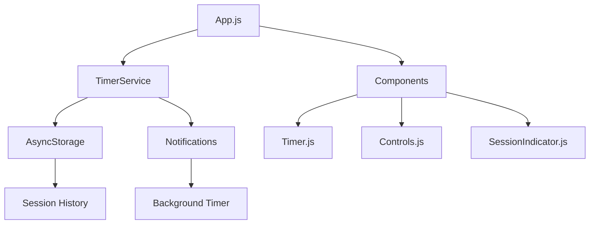

# 🏗️ PomodoroFlow Architecture

> **One-page overview of system design and patterns**

## System Overview

PomodoroFlow follows a **simple, event-driven architecture** optimized for mobile timer reliability and minimal complexity.



## Core Components

### 🕰️ TimerService (`/services/TimerService.js`)
**Role**: Central timer logic and state management
- **State**: Current phase (work/break), elapsed time, session count
- **Methods**: start(), pause(), reset(), complete()
- **Events**: onTick, onPhaseChange, onSessionComplete
- **Persistence**: Saves state to AsyncStorage on changes

### 📱 App.js
**Role**: Main application container and state coordinator
- **Responsibilities**: Navigation, global state, notification permissions
- **Patterns**: React Context for timer state sharing
- **Lifecycle**: Handles app foreground/background transitions

### 🎛️ Component Layer
**Pattern**: Presentational components with clear separation of concerns

| Component | Purpose | Props | State |
|-----------|---------|-------|-------|
| `Timer.js` | Display countdown | `timeRemaining`, `phase` | None (pure) |
| `Controls.js` | Start/pause/reset actions | `onStart`, `onPause`, `onReset` | Local button states |
| `SessionIndicator.js` | Progress visualization | `currentSession`, `totalSessions` | None (pure) |

## Data Flow

### Timer State Machine
```
[IDLE] --start()--> [RUNNING] --pause()--> [PAUSED]
   ^                    |                      |
   |                    v                      |
   +--reset()------ [COMPLETE] <--resume()----+
```

### Event Flow
1. **User Action** → Controls component
2. **Component** → TimerService method call
3. **TimerService** → State update + persistence
4. **State Change** → Component re-render via Context
5. **Background Timer** → Notification scheduling

## Storage Strategy

### AsyncStorage Schema
```javascript
{
  "timerState": {
    "phase": "work|break|longBreak",
    "timeRemaining": number,
    "isRunning": boolean,
    "sessionCount": number,
    "lastUpdated": timestamp
  },
  "sessionHistory": [
    {
      "date": "2024-01-15",
      "completedSessions": 4,
      "totalMinutes": 120
    }
  ],
  "settings": {
    "notificationsEnabled": boolean,
    "soundEnabled": boolean
  }
}
```

### Persistence Points
- **Timer state**: On every significant change (start/pause/phase change)
- **Session completion**: When work session finishes
- **Daily summary**: At end of day or app close

## Notification Architecture

### Local Scheduling Pattern
```javascript
// Schedule next notification
await Notifications.scheduleNotificationAsync({
  content: {
    title: "Break time!",
    body: "You've completed a focus session.",
    sound: 'default'
  },
  trigger: {
    seconds: timeRemaining
  }
});
```

### Background Handling
- **Foreground**: UI updates via React state
- **Background**: Notifications + background processing
- **Restoration**: Calculate elapsed time on app resume

## Performance Considerations

### Timer Precision
- **Challenge**: JavaScript timers drift over time
- **Solution**: Track elapsed time vs. wall clock time
- **Implementation**: Reconcile on app foreground

### Memory Management
- **Component Optimization**: React.memo for pure components
- **Timer Cleanup**: Clear intervals on component unmount
- **Storage Batching**: Debounce AsyncStorage writes

### Battery Optimization
- **Background Processing**: Minimal CPU usage
- **Notification Scheduling**: Batch operations
- **State Updates**: Only when necessary

## Accessibility Implementation

### Screen Reader Support
```javascript
<Pressable
  accessibilityLabel="Start timer"
  accessibilityHint="Begins 25-minute focus session"
  accessibilityRole="button"
>
```

### Haptic Feedback
- **Timer Start**: Light impact
- **Session Complete**: Medium impact
- **Long Break**: Heavy impact

### Reduced Motion
```javascript
const prefersReducedMotion = useAccessibilityInfo();
const animationConfig = prefersReducedMotion
  ? { duration: 0 }
  : { duration: 300 };
```

## Error Handling

### Graceful Degradation
- **Notification Failure**: Continue with visual-only mode
- **Storage Error**: Keep session in memory
- **Timer Drift**: Auto-correct on app resume

### Error Boundaries
```javascript
<ErrorBoundary fallback={<TimerErrorScreen />}>
  <TimerContainer />
</ErrorBoundary>
```

## Testing Strategy

### Unit Tests
- **TimerService**: State transitions, edge cases
- **Utils**: Time formatting, calculation functions
- **Storage**: AsyncStorage wrapper functions

### Integration Tests
- **Component Integration**: Timer + Controls interaction
- **Notification Flow**: Schedule → trigger → handle
- **State Persistence**: Save → restore → verify

### E2E Tests
- **Happy Path**: Start → complete session → break
- **Background Flow**: Timer running → app background → notification
- **Restoration**: Kill app → restart → verify state

## Development Patterns

### Code Organization
```
services/     # Business logic (no UI dependencies)
components/   # UI components (no business logic)
utils/        # Pure functions (no side effects)
hooks/        # Custom React hooks
types/        # TypeScript definitions (when migrated)
```

### State Management Philosophy
- **Local State**: Component-specific UI state
- **Context**: Timer state shared across components
- **AsyncStorage**: Persistent data and settings
- **Avoid**: Redux (overkill for simple timer)

---

**Key Principle**: Keep it simple, predictable, and focused on the core timer functionality.